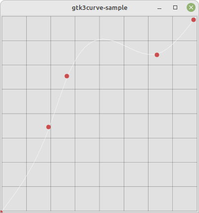
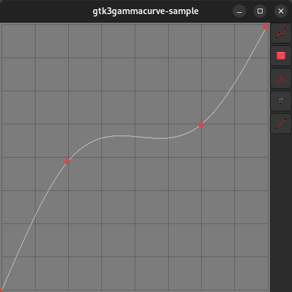

Gtk3Curve Widget and Gtk3GammaCurve
===

A Gtk+-3 Reimplementation of the GtkCurve and GtkGammaCurve widget from Gtk+-2.

* Features added ability to select background, grid & curve, and dot handle colors.

Note: Currently seems to have rounding issues when display curve data which seem to cause to to be slightly offset. Since this part was directly port as is it probably needs more fine tuning.
